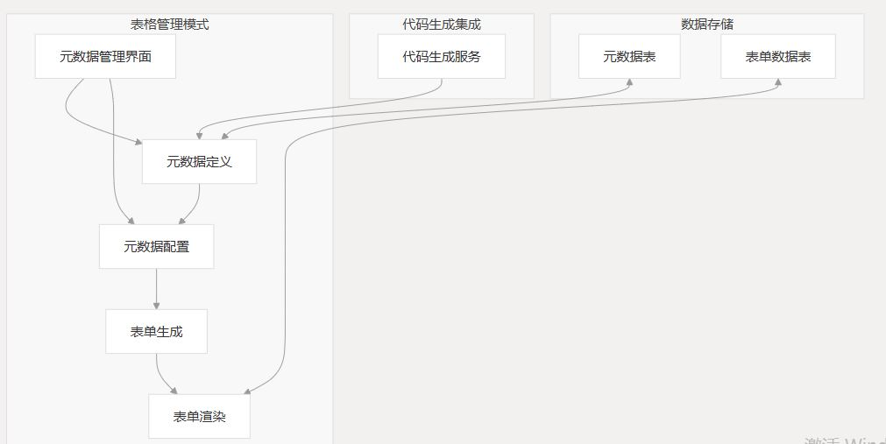

元数据驱动的表单管理系统设计文档
# 1. 系统概述
本设计文档描述了在CrowdMarket系统框架下实现的零代码表单管理模块，该模块基于元数据驱动，支持多租户架构，并包含表单设计、数据管理、业务规则管理和图表管理四个核心功能模块。

系统采用元数据驱动的方式，将表单定义、业务规则和图表配置存储在主数据库中，而将实际的业务数据存储在各租户的独立数据库中，实现了配置与数据的分离，提高了系统的灵活性和扩展性。

# 2. 系统架构

# 3. 数据库设计
## 3.1 主数据库表设计
### 3.1.1 表单元数据表 (form_metadata)
```
CREATE TABLE `form_metadata` (  
  `metadata_id` varchar(36) NOT NULL COMMENT '元数据ID',  
  `metadata_name` varchar(100) NOT NULL COMMENT '元数据名称',  
  `metadata_desc` varchar(500) DEFAULT NULL COMMENT '元数据描述',  
  `table_name` varchar(100) NOT NULL COMMENT '关联表名',  
  `status` tinyint NOT NULL DEFAULT '0' COMMENT '状态(0草稿,1发布,2停用)',  
  `tenant_id` varchar(20) NOT NULL COMMENT '租户ID',  
  `create_by` varchar(64) DEFAULT '' COMMENT '创建者',  
  `create_time` datetime DEFAULT NULL COMMENT '创建时间',  
  `update_by` varchar(64) DEFAULT '' COMMENT '更新者',  
  `update_time` datetime DEFAULT NULL COMMENT '更新时间',  
  PRIMARY KEY (`metadata_id`),  
  UNIQUE KEY `uk_metadata_name_tenant` (`metadata_name`,`tenant_id`)  
) ENGINE=InnoDB DEFAULT CHARSET=utf8 COMMENT='表单元数据表';
```

### 3.1.2 表单字段元数据表 (form_field_metadata)

```
CREATE TABLE `form_field_metadata` (  
  `field_id` varchar(36) NOT NULL COMMENT '字段ID',  
  `metadata_id` varchar(36) NOT NULL COMMENT '元数据ID',  
  `field_name` varchar(50) NOT NULL COMMENT '字段名称',  
  `field_label` varchar(100) NOT NULL COMMENT '字段标签',  
  `field_type` varchar(20) NOT NULL COMMENT '字段类型',  
  `column_name` varchar(50) NOT NULL COMMENT '数据库列名',  
  `column_type` varchar(50) NOT NULL COMMENT '数据库列类型',  
  `is_required` tinyint NOT NULL DEFAULT '0' COMMENT '是否必填(0否1是)',  
  `is_pk` tinyint NOT NULL DEFAULT '0' COMMENT '是否主键(0否1是)',  
  `is_list` tinyint NOT NULL DEFAULT '1' COMMENT '是否列表显示(0否1是)',  
  `is_query` tinyint NOT NULL DEFAULT '0' COMMENT '是否查询条件(0否1是)',  
  `query_type` varchar(20) DEFAULT 'EQ' COMMENT '查询方式(EQ等于,NE不等于,GT大于,LT小于,LIKE模糊,BETWEEN范围)',  
  `html_type` varchar(50) DEFAULT 'input' COMMENT '显示类型(input文本框,textarea文本域,select下拉框,checkbox复选框,radio单选框,datetime日期控件)',  
  `dict_type` varchar(100) DEFAULT NULL COMMENT '字典类型',  
  `sort_order` int NOT NULL DEFAULT '0' COMMENT '排序',  
  `tenant_id` varchar(20) NOT NULL COMMENT '租户ID',  
  PRIMARY KEY (`field_id`),  
  KEY `idx_metadata_id` (`metadata_id`)  
) ENGINE=InnoDB DEFAULT CHARSET=utf8 COMMENT='表单字段元数据表';
```

### 3.1.3 表单视图配置表 (form_view_config)

```
CREATE TABLE `form_view_config` (  
  `view_id` varchar(36) NOT NULL COMMENT '视图ID',  
  `metadata_id` varchar(36) NOT NULL COMMENT '元数据ID',  
  `view_name` varchar(100) NOT NULL COMMENT '视图名称',  
  `view_type` varchar(20) NOT NULL COMMENT '视图类型(form表单,list列表,detail详情)',  
  `view_config` text NOT NULL COMMENT '视图配置JSON',  
  `is_default` tinyint NOT NULL DEFAULT '0' COMMENT '是否默认视图(0否1是)',  
  `tenant_id` varchar(20) NOT NULL COMMENT '租户ID',  
  `create_by` varchar(64) DEFAULT '' COMMENT '创建者',  
  `create_time` datetime DEFAULT NULL COMMENT '创建时间',  
  `update_by` varchar(64) DEFAULT '' COMMENT '更新者',  
  `update_time` datetime DEFAULT NULL COMMENT '更新时间',  
  PRIMARY KEY (`view_id`),  
  KEY `idx_metadata_id` (`metadata_id`)  
) ENGINE=InnoDB DEFAULT CHARSET=utf8 COMMENT='表单视图配置表';
```

### 3.1.4 表单租户表映射 (form_tenant_table_mapping)

```
CREATE TABLE `form_tenant_table_mapping` (  
  `mapping_id` varchar(36) NOT NULL COMMENT '映射ID',  
  `metadata_id` varchar(36) NOT NULL COMMENT '元数据ID',  
  `tenant_id` varchar(20) NOT NULL COMMENT '租户ID',  
  `table_name` varchar(100) NOT NULL COMMENT '租户数据库中的表名',  
  `is_created` tinyint NOT NULL DEFAULT '0' COMMENT '表是否已创建(0否1是)',  
  `create_time` datetime DEFAULT NULL COMMENT '创建时间',  
  `update_time` datetime DEFAULT NULL COMMENT '更新时间',  
  PRIMARY KEY (`mapping_id`),  
  UNIQUE KEY `uk_metadata_tenant` (`metadata_id`,`tenant_id`)  
) ENGINE=InnoDB DEFAULT CHARSET=utf8 COMMENT='表单租户表映射'; 
```

### 3.1.5 业务规则表 (form_rule)

```
CREATE TABLE `form_rule` (  
  `rule_id` varchar(36) NOT NULL COMMENT '规则ID',  
  `metadata_id` varchar(36) NOT NULL COMMENT '元数据ID',  
  `rule_name` varchar(100) NOT NULL COMMENT '规则名称',  
  `rule_type` varchar(20) NOT NULL COMMENT '规则类型(validation,calculation,visibility,dependency,workflow)',  
  `rule_desc` varchar(500) DEFAULT NULL COMMENT '规则描述',  
  `is_active` tinyint NOT NULL DEFAULT '1' COMMENT '是否启用(0否1是)',  
  `execution_order` int NOT NULL DEFAULT '0' COMMENT '执行顺序',  
  `tenant_id` varchar(20) NOT NULL COMMENT '租户ID',  
  `create_by` varchar(64) DEFAULT '' COMMENT '创建者',  
  `create_time` datetime DEFAULT NULL COMMENT '创建时间',  
  `update_by` varchar(64) DEFAULT '' COMMENT '更新者',  
  `update_time` datetime DEFAULT NULL COMMENT '更新时间',  
  PRIMARY KEY (`rule_id`),  
  KEY `idx_metadata_id` (`metadata_id`)  
) ENGINE=InnoDB DEFAULT CHARSET=utf8 COMMENT='表单规则定义表';  
```

### 3.1.6 规则条件表 (form_rule_condition)

```
CREATE TABLE `form_rule_condition` (  
  `condition_id` varchar(36) NOT NULL COMMENT '条件ID',  
  `rule_id` varchar(36) NOT NULL COMMENT '规则ID',  
  `field_id` varchar(36) NOT NULL COMMENT '字段ID',  
  `operator` varchar(20) NOT NULL COMMENT '操作符(eq,ne,gt,lt,ge,le,contains,startswith,endswith)',  
  `value` varchar(500) DEFAULT NULL COMMENT '比较值',  
  `logic_type` varchar(10) NOT NULL DEFAULT 'AND' COMMENT '逻辑类型(AND,OR)',  
  `group_id` varchar(36) DEFAULT NULL COMMENT '条件组ID',  
  `tenant_id` varchar(20) NOT NULL COMMENT '租户ID',  
  PRIMARY KEY (`condition_id`),  
  KEY `idx_rule_id` (`rule_id`)  
) ENGINE=InnoDB DEFAULT CHARSET=utf8 COMMENT='表单规则条件表';  
```

### 3.1.7 规则动作表 (form_rule_action)

```
CREATE TABLE `form_rule_action` (  
  `action_id` varchar(36) NOT NULL COMMENT '动作ID',  
  `rule_id` varchar(36) NOT NULL COMMENT '规则ID',  
  `action_type` varchar(20) NOT NULL COMMENT '动作类型(setValue,setVisible,setRequired,setReadOnly,calculate,message,api)',  
  `target_field_id` varchar(36) DEFAULT NULL COMMENT '目标字段ID',  
  `action_value` text COMMENT '动作值',  
  `action_script` text COMMENT '动作脚本',  
  `tenant_id` varchar(20) NOT NULL COMMENT '租户ID',  
  PRIMARY KEY (`action_id`),  
  KEY `idx_rule_id` (`rule_id`)  
) ENGINE=InnoDB DEFAULT CHARSET=utf8 COMMENT='表单规则动作表';  
```

### 3.1.8 图表元数据表 (chart_metadata)

```
CREATE TABLE `chart_metadata` (  
  `chart_id` varchar(36) NOT NULL COMMENT '图表ID',  
  `chart_name` varchar(100) NOT NULL COMMENT '图表名称',  
  `chart_desc` varchar(500) DEFAULT NULL COMMENT '图表描述',  
  `chart_type` varchar(20) NOT NULL COMMENT '图表类型(bar柱状图,line折线图,pie饼图,radar雷达图等)',  
  `metadata_id` varchar(36) NOT NULL COMMENT '关联的表单元数据ID',  
  `status` tinyint NOT NULL DEFAULT '0' COMMENT '状态(0草稿,1发布,2停用)',  
  `tenant_id` varchar(20) NOT NULL COMMENT '租户ID',  
  `create_by` varchar(64) DEFAULT '' COMMENT '创建者',  
  `create_time` datetime DEFAULT NULL COMMENT '创建时间',  
  `update_by` varchar(64) DEFAULT '' COMMENT '更新者',  
  `update_time` datetime DEFAULT NULL COMMENT '更新时间',  
  PRIMARY KEY (`chart_id`),  
  KEY `idx_metadata_id` (`metadata_id`),  
  KEY `idx_tenant_id` (`tenant_id`)  
) ENGINE=InnoDB DEFAULT CHARSET=utf8 COMMENT='图表元数据表';  
```

### 3.1.9 图表配置表 (chart_config)

```
CREATE TABLE `chart_config` (  
  `config_id` varchar(36) NOT NULL COMMENT '配置ID',  
  `chart_id` varchar(36) NOT NULL COMMENT '图表ID',  
  `dimension_fields` text COMMENT '维度字段JSON',  
  `measure_fields` text COMMENT '度量字段JSON',  
  `filter_condition` text COMMENT '过滤条件JSON',  
  `sort_config` text COMMENT '排序配置JSON',  
  `style_config` text COMMENT '样式配置JSON',  
  `data_limit` int DEFAULT '1000' COMMENT '数据限制条数',  
  `refresh_interval` int DEFAULT '0' COMMENT '刷新间隔(秒)',  
  `tenant_id` varchar(20) NOT NULL COMMENT '租户ID',  
  PRIMARY KEY (`config_id`),  
  KEY `idx_chart_id` (`chart_id`)  
) ENGINE=InnoDB DEFAULT CHARSET=utf8 COMMENT='图表配置表'; 
```

### 3.1.10 租户数据库配置表 (tenant_database)
```
CREATE TABLE `tenant_database` (  
  `id` varchar(36) NOT NULL COMMENT '主键ID',  
  `tenant_id` varchar(20) NOT NULL COMMENT '租户ID',  
  `db_name` varchar(100) NOT NULL COMMENT '数据库名称',  
  `db_host` varchar(100) NOT NULL COMMENT '数据库主机',  
  `db_port` int NOT NULL COMMENT '数据库端口',  
  `db_username` varchar(100) NOT NULL COMMENT '数据库用户名',  
  `db_password` varchar(255) NOT NULL COMMENT '数据库密码(加密)',  
  `status` tinyint NOT NULL DEFAULT '1' COMMENT '状态(0停用,1启用)',  
  `create_by` varchar(64) DEFAULT '' COMMENT '创建者',  
  `create_time` datetime NOT NULL COMMENT '创建时间',  
  `update_by` varchar(64) DEFAULT '' COMMENT '更新者',  
  `update_time` datetime DEFAULT NULL COMMENT '更新时间',  
  PRIMARY KEY (`id`),  
  UNIQUE KEY `uk_tenant_id` (`tenant_id`)  
) ENGINE=InnoDB DEFAULT CHARSET=utf8 COMMENT='租户数据库配置表';  
```


## 3.2 租户数据库表设计
在每个租户的独立数据库中，系统会根据表单元数据动态创建数据表。表名格式为：form_data_{metadata_id_without_hyphens}。

例如，对于ID为"a1b2c3d4-e5f6"的表单元数据，在租户数据库中会创建名为form_data_a1b2c3d4e5f6的表。

# 4. 核心功能模块
## 4.1 表单元数据管理模块
### 4.1.1 功能概述
表单元数据管理模块负责管理表单的定义和结构，包括表单基本信息、字段定义和视图配置等。该模块采用表格管理模式，支持从数据库中提取元数据，简化表单创建过程。

### 4.1.2 主要功能
1. 元数据定义管理：允许用户定义表单的基本信息和字段结构
- 表单基本信息管理：名称、描述、状态等
- 字段元数据管理：字段名称、类型、验证规则等
- 数据库映射管理：字段与数据库列的映射关系

2. 从数据库提取元数据：支持从现有数据库表中导入元数据
- 数据库表浏览：查看可用的数据库表
- 表结构解析：自动解析表结构，生成字段元数据
- 元数据调整：导入后可进行调整和优化

3. 视图配置管理：基于元数据定义配置不同的表单视图
- 表单视图：配置表单的布局、样式、验证规则等
- 列表视图：配置列表的显示字段、排序、过滤条件等
- 详情视图：配置详情页的显示字段、布局等

4. 元数据预览：预览基于元数据生成的表单、列表和详情页

## 4.2 表单数据管理模块
### 4.2.1 功能概述
表单数据管理模块负责处理表单数据的增删改查操作，将数据存储在租户特定的数据库中。该模块基于元数据定义和视图配置，提供统一的数据管理界面。

1. 4.2.2 主要功能
- 数据表生成：根据表单元数据在租户数据库中生成物理表
- 表结构生成：根据字段元数据生成表结构
- 字段映射：将表单字段映射到数据库列
- 表关系维护：维护表单元数据与物理表的映射关系

2. 数据操作：提供表单数据的增删改查功能
- 数据添加：通过表单添加数据
- 数据编辑：修改现有数据
- 数据删除：删除数据
- 数据查询：根据条件查询数据

3. 数据导入导出：支持数据的批量导入和导出
Excel导入：从Excel文件导入数据
Excel导出：将数据导出为Excel文件
数据模板：生成数据导入模板

4. 数据权限控制：基于角色的数据访问控制
数据行权限：控制用户可访问的数据行
数据列权限：控制用户可访问的数据列
操作权限：控制用户可执行的操作（增、删、改、查）

## 4.3 业务规则管理模块
### 4.3.1 功能概述
业务规则管理模块允许用户定义和管理表单的业务逻辑，无需编写代码。业务规则在表单数据的生命周期中执行，确保数据符合业务需求。

### 4.3.2 主要功能
1. 规则定义：定义不同类型的业务规则
验证规则：字段级和表单级的数据验证
计算规则：基于其他字段值的自动计算
可见性规则：控制字段的显示和隐藏
依赖规则：字段值变化影响其他字段
工作流规则：触发数据变更后的操作

2. 条件配置：配置规则的触发条件
简单条件：单一字段的条件判断
复合条件：多个条件的逻辑组合（AND/OR）
条件组：条件的分组管理

3. 动作配置：配置规则触发后的动作
设置值：设置字段的值
设置可见性：控制字段的显示和隐藏
设置必填：控制字段是否必填
设置只读：控制字段是否只读
消息提示：显示提示信息
调用API：触发外部API调用


4. 规则执行：在表单生命周期中执行规则
加载时执行：表单加载时执行规则
值变化时执行：字段值变化时执行规则
提交前执行：表单提交前执行规则
提交后执行：表单提交后执行规则


## 4.4 图表管理模块
### 4.4.1 功能概述
图表管理模块基于表单元数据和数据，提供零代码的图表设计和展示功能。用户可以通过简单的配置创建各种类型的图表，实现数据可视化。

### 4.4.2 主要功能
1. 图表设计：设计不同类型的图表
图表类型选择：柱状图、折线图、饼图、雷达图等
数据源选择：选择表单元数据作为数据源
维度配置：选择图表的维度字段
度量配置：选择图表的度量字段和聚合方式

2. 数据过滤和排序：配置图表数据的过滤和排序规则
过滤条件：设置数据筛选条件
排序规则：设置数据排序规则
数据限制：限制显示的数据量

3. 样式配置：配置图表的显示样式
颜色配置：设置图表颜色
标题配置：设置图表标题和副标题
图例配置：设置图表图例
坐标轴配置：设置坐标轴标签和刻度

4. 图表展示和交互：展示图表并支持交互操作
图表渲染：根据配置渲染图表
数据钻取：支持点击图表元素进行数据钻取
图表导出：导出图表为图片或PDF
图表嵌入：将图表嵌入到其他页面


# 5. 技术实现
## 5.1 后端实现
### 5.1.1 表单元数据服务
表单元数据服务负责管理表单的元数据定义，包括表单基本信息、字段定义和视图配置等。主要包括以下组件：

FormMetadataService：管理表单元数据
FormFieldMetadataService：管理字段元数据
FormViewConfigService：管理视图配置
DatabaseMetadataService：从数据库提取元数据


### 5.1.2 表单数据服务
表单数据服务负责处理表单数据的增删改查操作，将数据存储在租户特定的数据库中。主要包括以下组件：

TableGenerationService：生成租户数据表
FormDataService：处理表单数据操作
FormQueryService：处理表单数据查询
FormImportExportService：处理数据导入导出

### 5.1.3 业务规则服务
业务规则服务负责管理和执行表单的业务规则。主要包括以下组件：

FormRuleService：管理业务规则定义
RuleConditionService：管理规则条件
RuleActionService：管理规则动作
RuleExecutionEngine：执行业务规则

### 5.1.4 图表服务
图表服务负责管理图表的定义和数据查询。主要包括以下组件：

ChartMetadataService：管理图表元数据
ChartConfigService：管理图表配置
ChartDataService：处理图表数据查询
ChartExportService：处理图表导出

### 5.1.5 租户数据库服务
租户数据库服务负责管理租户特定的数据库连接。主要包括以下组件：

TenantDatabaseService：管理租户数据库配置
DynamicDataSourceService：动态管理数据源
TenantDatabaseInterceptor：处理租户数据库请求拦截

## 5.2 前端实现

### 5.2.1 表单元数据管理界面
表单元数据管理界面提供用户友好的界面，用于管理表单元数据。主要包括以下组件：

MetadataListComponent：显示表单元数据列表
MetadataEditorComponent：编辑表单元数据
FieldMetadataComponent：管理字段元数据
ViewConfigComponent：配置表单视图
DatabaseImportComponent：从数据库导入元数据

### 5.2.2 表单数据管理界面
表单数据管理界面提供统一的界面，用于管理表单数据。主要包括以下组件：

FormComponent：表单数据录入和编辑
ListComponent：表单数据列表
DetailComponent：表单数据详情
ImportExportComponent：数据导入导出

### 5.2.3 业务规则管理界面
业务规则管理界面提供直观的界面，用于定义和管理业务规则。主要包括以下组件：

RuleListComponent：显示业务规则列表
RuleEditorComponent：编辑业务规则
ConditionEditorComponent：编辑规则条件
ActionEditorComponent：编辑规则动作

### 5.2.4 图表管理界面
图表管理界面提供简单的界面，用于设计和管理图表。主要包括以下组件：

ChartListComponent：显示图表列表
ChartDesignerComponent：设计图表
ChartPreviewComponent：预览图表
ChartExportComponent：导出图表

# 6. 系统集成
## 6.1 与CrowdMarket系统的集成
### 6.1.1 菜单集成
将表单管理模块的菜单项集成到CrowdMarket系统的菜单体系中：

表单设计：表单元数据管理
表单数据：表单数据管理
业务规则：业务规则管理
图表管理：图表设计和管理


### 6.1.2 权限集成
将表单管理模块的权限集成到CrowdMarket系统的权限体系中：

表单设计权限：控制表单元数据的访问和操作权限
表单数据权限：控制表单数据的访问和操作权限
业务规则权限：控制业务规则的访问和操作权限
图表权限：控制图表的访问和操作权限

### 6.1.3 用户认证集成
利用CrowdMarket系统的用户认证机制，确保只有授权用户才能访问表单管理模块：

用户认证：使用系统的用户认证机制
租户隔离：确保用户只能访问自己租户的数据
角色授权：基于用户角色控制功能访问

## 6.2 与其他系统的集成
### 6.2.1 数据集成
支持与其他系统进行数据集成：

API接口：提供RESTful API接口，供其他系统调用
数据导入导出：支持数据的批量导入和导出
数据同步：支持与其他系统的数据同步


### 6.2.2 功能集成
支持将表单和图表嵌入到其他系统中：

表单嵌入：将表单嵌入到其他系统的页面中
图表嵌入：将图表嵌入到其他系统的页面中
单点登录：支持与其他系统的单点登录集成

# 7. 部署和配置
## 7.1 系统部署
表单管理模块作为CrowdMarket系统的一个组件进行部署：

后端部署：部署后端服务
前端部署：部署前端界面
数据库部署：部署主数据库和租户数据库


## 7.2 系统配置
系统提供以下配置项：

数据库配置：配置主数据库和租户数据库连接信息
文件存储配置：配置文件存储路径
缓存配置：配置缓存参数
安全配置：配置安全参数

# 8. 系统扩展性
## 8.1 功能扩展
系统设计考虑了功能扩展的需求：

组件扩展：支持添加新的表单组件
规则扩展：支持添加新的业务规则类型
图表扩展：支持添加新的图表类

## 8.2 数据模型扩展
系统支持数据模型的扩展和演化：

字段类型扩展：支持添加新的字段类型
数据关系扩展：支持定义表单之间的关系
数据验证扩展：支持添加新的数据验证规则
8.3 API扩展
系统提供完整的API接口，支持第三方系统集成：

REST API：提供标准的REST API接口
WebHook：支持事件触发的WebHook
自定义API：支持自定义API接口

# 9. 多租户数据库管理
## 9.1 租户数据库架构
每个租户拥有独立的业务数据库，实现数据的物理隔离：

主数据库：存储系统级配置和元数据
租户数据库：存储租户特定的业务数据
数据库映射：维护元数据与租户数据库表的映射关系

## 9.2 租户数据库管理功能
系统提供完整的租户数据库管理功能：

数据库创建：自动为新租户创建数据库
数据库配置：管理租户数据库的连接信息
数据库监控：监控租户数据库的状态和性能
数据库备份：定期备份租户数据库

## 9.3 动态数据源管理
系统支持动态切换数据源，实现多租户数据访问：

数据源路由：根据当前租户ID路由到对应的数据源
数据源缓存：缓存数据源连接，提高性能
数据源监控：监控数据源的使用情况


# 10. 性能和安全考虑
## 10.1 性能优化
系统在设计上考虑了性能优化：

数据库优化：优化数据库表结构和索引
查询优化：优化SQL查询，减少数据库负载
缓存策略：使用多级缓存，减少数据库访问
异步处理：使用异步处理大量数据操作


## 10.2 安全措施
系统实现了多层次的安全保障：

数据隔离：租户数据物理隔离，确保数据安全
访问控制：基于角色的访问控制，精细化权限管理
数据加密：敏感数据加密存储
操作审计：记录用户操作，支持安全审计

# 11. 用户体验设计
## 11.1 界面设计原则
系统界面设计遵循以下原则：

简洁直观：界面简洁清晰，操作直观
一致性：保持界面风格和操作方式的一致性
响应式：支持不同设备和屏幕尺寸
可定制：支持界面主题和布局定制

## 11.2 操作流程优化
系统优化了主要操作流程：

表单设计流程：简化表单设计步骤，提高效率
数据管理流程：优化数据录入和查询流程
规则配置流程：简化规则配置，降低学习成本
图表设计流程：简化图表设计，快速实现数据可视化

# 12. 系统监控和运维
## 12.1 监控功能
系统提供全面的监控功能：

性能监控：监控系统性能指标
异常监控：监控系统异常和错误
用户行为监控：监控用户操作和访问情况
数据库监控：监控数据库性能和状态
## 12.2 运维功能
系统提供便捷的运维功能：

配置管理：集中管理系统配置
日志管理：集中管理系统日志
备份恢复：支持数据备份和恢复
版本升级：支持系统平滑升级


# 13. 实施和推广策略
## 13.1 实施步骤
系统实施分为以下步骤：

需求分析：分析用户需求和业务场景
系统设计：设计系统架构和功能模块
系统开发：开发系统功能和界面
系统测试：测试系统功能和性能
系统部署：部署系统到生产环境
用户培训：培训用户使用系统
系统上线：系统正式上线使用

## 13.2 推广策略
系统推广采用以下策略：

示范应用：选择典型业务场景进行示范应用
用户培训：提供全面的用户培训和文档
技术支持：提供及时的技术支持和问题解决
持续优化：根据用户反馈持续优化系统

# 14. 总结与展望
## 14.1 系统价值
元数据驱动的表单管理系统为企业带来以下价值：

提高效率：零代码开发，快速构建业务应用
降低成本：减少开发和维护成本
增强灵活性：快速响应业务变化
提升体验：提供统一、一致的用户体验

## 14.2 未来展望
系统未来将向以下方向发展：

智能化：引入AI技术，提供智能推荐和辅助设计
移动化：增强移动端支持，提供全面的移动应用体验
集成化：增强与其他系统的集成能力
生态化：构建开放的应用生态，支持第三方扩展

# 附录
## 附录A：术语表
|术语|	定义|
|-----|------------------------------------------|
|元数据|	描述数据的数据，本系统中指表单的结构定义|
|表单元数据|	描述表单结构的数据，包括字段、验证规则等|
|业务规则|	定义业务逻辑的规则，控制表单的行为|
|租户|	系统的独立用户组织，拥有独立的数据和配置|
|多租户|	一个系统实例服务多个租户的架构模式|

## 附录B：参考资料
- CrowdMarket系统架构文档
- 元数据驱动开发最佳实践
- 多租户系统设计模式
- 零代码开发平台设计指南


根据上述需求描述，需要生成的文件包括：

# 1. 数据库脚本文件
首先，需要生成包含所有表结构定义的SQL脚本文件：

```
sql/metadata_tables.sql  # 包含所有元数据相关表的创建脚本  
```

# 2. ruoyi-metadata模块核心文件
## 2.1 实体类（Entity）
- com.ruoyi.metadata.domain.FormMetadata.java  
- com.ruoyi.metadata.domain.FormFieldMetadata.java  
- com.ruoyi.metadata.domain.FormViewConfig.java  
- com.ruoyi.metadata.domain.FormTenantTableMapping.java  
- com.ruoyi.metadata.domain.FormRule.java  
- com.ruoyi.metadata.domain.FormRuleCondition.java  
- com.ruoyi.metadata.domain.FormRuleAction.java  
- com.ruoyi.metadata.domain.ChartMetadata.java  
- com.ruoyi.metadata.domain.ChartConfig.java  
- com.ruoyi.metadata.domain.TenantDatabase.java  

## 2.2 数据访问层（Mapper）
- com.ruoyi.metadata.mapper.FormMetadataMapper.java  
- com.ruoyi.metadata.mapper.FormFieldMetadataMapper.java  
- com.ruoyi.metadata.mapper.FormViewConfigMapper.java  
- com.ruoyi.metadata.mapper.FormTenantTableMappingMapper.java  
- com.ruoyi.metadata.mapper.FormRuleMapper.java  
- com.ruoyi.metadata.mapper.FormRuleConditionMapper.java  
- com.ruoyi.metadata.mapper.FormRuleActionMapper.java  
- com.ruoyi.metadata.mapper.ChartMetadataMapper.java  
- com.ruoyi.metadata.mapper.ChartConfigMapper.java  
- com.ruoyi.metadata.mapper.TenantDatabaseMapper.java  

对应的XML映射文件：

- resources/mapper/metadata/FormMetadataMapper.xml  
- resources/mapper/metadata/FormFieldMetadataMapper.xml  
- resources/mapper/metadata/FormViewConfigMapper.xml  
- resources/mapper/metadata/FormTenantTableMappingMapper.xml  
- resources/mapper/metadata/FormRuleMapper.xml  
- resources/mapper/metadata/FormRuleConditionMapper.xml  
- resources/mapper/metadata/FormRuleActionMapper.xml  
- resources/mapper/metadata/ChartMetadataMapper.xml  
- resources/mapper/metadata/ChartConfigMapper.xml  
- resources/mapper/metadata/TenantDatabaseMapper.xml  

## 2.3 服务接口和实现类（Service）
- com.ruoyi.metadata.service.IFormMetadataService.java  
- com.ruoyi.metadata.service.IFormFieldMetadataService.java  
- com.ruoyi.metadata.service.IFormViewConfigService.java  
- com.ruoyi.metadata.service.IFormTenantTableMappingService.java  
- com.ruoyi.metadata.service.IFormRuleService.java  
- com.ruoyi.metadata.service.IFormRuleConditionService.java  
- com.ruoyi.metadata.service.IFormRuleActionService.java  
- com.ruoyi.metadata.service.IChartMetadataService.java  
- com.ruoyi.metadata.service.IChartConfigService.java  
- com.ruoyi.metadata.service.ITenantDatabaseService.java  
- com.ruoyi.metadata.service.IDatabaseMetadataService.java  
  
- com.ruoyi.metadata.service.impl.FormMetadataServiceImpl.java  
- com.ruoyi.metadata.service.impl.FormFieldMetadataServiceImpl.java  
- com.ruoyi.metadata.service.impl.FormViewConfigServiceImpl.java  
- com.ruoyi.metadata.service.impl.FormTenantTableMappingServiceImpl.java  
- com.ruoyi.metadata.service.impl.FormRuleServiceImpl.java  
- com.ruoyi.metadata.service.impl.FormRuleConditionServiceImpl.java  
- com.ruoyi.metadata.service.impl.FormRuleActionServiceImpl.java  
- com.ruoyi.metadata.service.impl.ChartMetadataServiceImpl.java  
- com.ruoyi.metadata.service.impl.ChartConfigServiceImpl.java  
- com.ruoyi.metadata.service.impl.TenantDatabaseServiceImpl.java  
- com.ruoyi.metadata.service.impl.DatabaseMetadataServiceImpl.java  

## 2.4 控制器（Controller）
- com.ruoyi.metadata.controller.FormMetadataController.java  
- com.ruoyi.metadata.controller.FormFieldMetadataController.java  
- com.ruoyi.metadata.controller.FormViewConfigController.java  
- com.ruoyi.metadata.controller.FormRuleController.java  
- com.ruoyi.metadata.controller.ChartMetadataController.java  
- com.ruoyi.metadata.controller.ChartConfigController.java  
- com.ruoyi.metadata.controller.TenantDatabaseController.java  
- com.ruoyi.metadata.controller.DatabaseMetadataController.java  

# 3. ruoyi-formdata模块核心文件

## 3.1 服务接口和实现类（Service）
- com.ruoyi.formdata.service.ITableGenerationService.java  
- com.ruoyi.formdata.service.IFormDataService.java  
- com.ruoyi.formdata.service.IFormQueryService.java  
- com.ruoyi.formdata.service.IFormImportExportService.java  
- com.ruoyi.formdata.service.IRuleExecutionEngine.java  
  
- com.ruoyi.formdata.service.impl.TableGenerationServiceImpl.java  
- com.ruoyi.formdata.service.impl.FormDataServiceImpl.java  
- com.ruoyi.formdata.service.impl.FormQueryServiceImpl.java  
- com.ruoyi.formdata.service.impl.FormImportExportServiceImpl.java  
- com.ruoyi.formdata.service.impl.RuleExecutionEngineImpl.java  

## 3.2 控制器（Controller）
- com.ruoyi.formdata.controller.FormDataController.java  

## 3.3 数据源管理
- com.ruoyi.formdata.datasource.DynamicDataSourceService.java  
- com.ruoyi.formdata.datasource.TenantDatabaseInterceptor.java  
- com.ruoyi.formdata.datasource.DynamicDataSourceConfig.java 

# 4. 前端文件

## 4.1 表单元数据管理前端
- src/views/metadata/form/index.vue  # 表单元数据列表  
- src/views/metadata/form/edit.vue   # 表单元数据编辑  
- src/views/metadata/field/index.vue # 字段元数据管理  
- src/views/metadata/view/index.vue  # 视图配置管理  
- src/views/metadata/import/index.vue # 数据库导入元数据  

## 4.2 表单数据管理前端
- src/views/formdata/index.vue       # 表单数据列表  
- src/views/formdata/form.vue        # 表单数据录入和编辑  
- src/views/formdata/detail.vue      # 表单数据详情  
- src/views/formdata/import.vue      # 数据导入导出  

## 4.3 业务规则管理前端
- src/views/rule/index.vue           # 业务规则列表  
- src/views/rule/edit.vue            # 业务规则编辑  
- src/views/rule/condition.vue       # 规则条件编辑  
- src/views/rule/action.vue          # 规则动作编辑  

## 4.4 图表管理前端
- src/views/chart/index.vue          # 图表列表  
- src/views/chart/design.vue         # 图表设计  
- src/views/chart/preview.vue        # 图表预览  
- src/views/chart/export.vue         # 图表导出  


## 4.5 前端组件库

- src/components/FormDesigner/index.vue  
- src/components/FormRenderer/index.vue  
- src/components/ChartDesigner/index.vue  
- src/components/RuleDesigner/index.vue  

## 4.6 前端API调用服务

- src/api/metadata/form.js  
- src/api/metadata/field.js  
- src/api/metadata/view.js  
- src/api/metadata/rule.js  
- src/api/metadata/chart.js  
- src/api/formdata/index.js  
- 
# 5. 配置文件
- ruoyi-metadata/src/main/resources/application.yml  
- ruoyi-formdata/src/main/resources/application.yml  

# 6. 单元测试文件
- ruoyi-metadata/src/test/java/com/ruoyi/metadata/service/*Test.java  
- ruoyi-formdata/src/test/java/com/ruoyi/formdata/service/*Test.java  

# 7. 模块配置文件
- ruoyi-metadata/pom.xml  
- ruoyi-formdata/pom.xml  

# 8. 权限菜单SQL
sql/metadata_menu.sql  # 包含所有元数据相关菜单和权限的SQL  


8. 系统集成配置：

- ruoyi-admin/src/main/resources/application.yml中添加新模块配置  
- 主pom.xml中添加新模块依赖  

